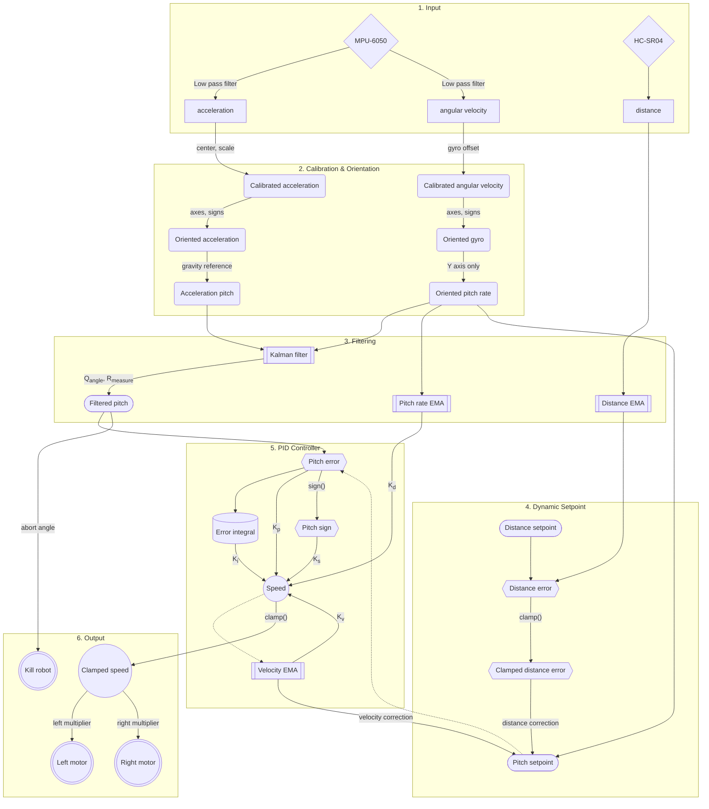

# Balance Bot
Balancing robot for UCSD SPIS 2026 Final Project.

## Description
The balance bot only has two wheels and it must stay upright by accelerating to catch itself when it tilts.

It uses an accelerometer and gyroscope (MPU-6050), and ultrasonic distance sensor (HC-SR04) as inputs and DC gearmotors powered at 12V (8x AA batteries) outputs using a motor driver (TB6612FNG).
The microcontroller used is the Raspberry Pi 4 Model B, with source code written in Python.

### Conventions
The reference frame used is the robot's.

The +x axis is perpendicular to the front of the robot.
The +y axis is to the left side of the robot.
The +z axis is to the top of the robot.

Roll, pitch, and yaw go counterclockwise around their respective positive axes of x, y, z using the right-hand-rule.
Only pitch is important to the robot.
The robot tilting forward is positive pitch, and the robot standing upright is a pitch of `0.0`.

The motor output (throttle or speed) is such that a positive output moves the robot forward and a negative output moves the robot backwards.

## Calibration
First, we must correct any offset and/or scaling biases of the MPU by calibrating it in software.

### Acceleration
The script to calibrate acceleration is in [`calibrate_acceleration.py`](calibrate_acceleration.py).
Following the instruction of the script, we place each axis (±x, ±y, ±z) of the MPU in the direction of gravity. Once ready, we collect samples of values and calculate the center (bias) from both the span and from zero points, and scale from the span: $(2g) / (\max(up) - \min(down))$.

For usage, we re-scale the collected acceleration data for each axis: $(accel - center) * scale$.

### Gyro (Angular Velocity)
The script to calibrate the gyro is in [`calibrate_gyro.py`](calibrate_gyro.py). Scaling is not done because there is no reliable way to get a nonzero reference magnitude, like g for acceleration.
We are only going to calibrate for bias. Following the instructions, we keeping the MPU perfectly still, and average samples for the x, y, and z bias: $\sum(gyro) / samples$.

For usage, we subtract the bias (offset) from the measured gyro: $gyro - offset$.

## Filtering
Sensor data is extremely noisy because of motor vibration, acceleration pollution, etc.
Therefore, we use two types of filters to smooth and parse raw data.

### Time Independent Exponential Moving Average (EMA)
The simplest filter is an exponential moving average, which simply calculates the new value by taking a weighted average of the old value and the current measurement, with the weight for the measurement being a value $\alpha$ (alpha) from `0` (no change) to `1` (no filtering).

Since the old value consists of its own value and measurement, the new value would consist of $\alpha^2$ of the 2nd previous frame, $\alpha^3$ of the 3rd previous frame, etc., hence the name exponential moving average.

However, if the tick rate changes, then the time it takes for the new value to react changes, so using math, the EMA is isolated from the delta time or tick rate.
The new parameter is $\tau$ (tau), which represents the amount of time it takes for the new value to update to approximately 63.2% ($1-\frac{1}{e}$) of a change.

This EMA filter is used to smooth many arbitrary variables.

### Pitch (Tilt)
Using some math, we can figure out the pitch in 2 ways:
- Using acceleration (good absolute reference, but very noisy): $\arctan(-accel_x / \sqrt{accel_y^2+accel_z^2})$
- Using gyro (angular velocity) (track movements very well, but accumulate error over time due to integration): $\int_{0}^{t} \omega \,dt$
 
We need a way to get the best of both worlds, which we also currently have 2 ways:
- Complementary filter: weighted sum of acceleration and gyro, usually 95-98% gyro.
  - In the short term, the accurate gyro is trusted, but drift is prevented by the absolute gravity acceleration reference.
- Kalman filter: left as a simple exercise to the reader

We started with complementary filter, but ended up using Kalman filter as its built-in physical model greatly reduces noise.

## Balancing
The robot must accelerate forward when it tips forward, within a very short timeframe (<50ms).

### First basic idea: PID
The primary control system is a simple PID controller. This is common and widely used in robotics and control theory to move a mechanism or system to a setpoint, by applying effort or output based on the error ($error = setpoint - pitch$)
- **P**roportion: $K_p * error$ for some constant $K_p$. This acts like a spring, with output proportional to how far the measurement is from the setpoint.
- **I**ntegral: $K_i * \int_{0}^{t} error \,dt$ for some constant $K_i$. This acts on the accumulation of error. For example, the robot being consistently away from the setpoint will increase the integral, eventually correcting it.
- **D**erivative: $-K_d * \frac{d}{dx}(pitch)$, for some constant $K_d$. This acts like spring dampening, preventing overshooting of the setpoint by reducing output if the error is decreasing quickly over time.

This works exactly as intended for when the robot's linear (forward/backward) velocity is low, as the motors have plenty of throttle available to compensate for any pitch.

However, as the bot moves around to balance, the bot's linear velocity can drift and increase in magnitude, which makes it harder for motors to accelerate. For example, the bot could reach its maximum linear velocity in one direction, which prevents the bot from correcting itself.

### Velocity Correction & Dynamic Setpoint
The solution to this is to measure the linear velocity of the bot, and if it's "high" for a long enough time, then we nudge the setpoint the opposite way, or apply extra output in one direction, which will bias the PID to, over time, move the robot the other way to decrease its velocity.

A naive way to track the linear velocity of the robot is to integrate the linear acceleration over time. But as time passes, it will accumulate significant error because there is no absolute reference to correct it, especially if there is tiny bias in the accelerometer.

Instead, we can use the throttle as the proxy for the linear velocity of the bot. If the motors are generally outputting in one direction, we can assume the bot's velocity is in that direction. Since higher velocities mean lower acceleration for the same motor throttle, the system actually tends towards zero velocity, meaning it will not drift over time.

We settled on using an EMA on throttle, with $\tau$ around 0.5 seconds, to smooth out any oscillations or vibrations. This filtered throttle is then used to offset the setpoint (after being passed to $\arctan$) using a velocity correction constant, and also contribute to the throttle using a $K_v$ gain.

## Maintaining Position
The bot can now balance almost indefinitely on a flat plane, as long as the batteries will allow, but it still does not know its absolute position. It will naturally drift around the room while balancing, potentially hitting an obstacle. To fix this, we added an ultrasonic distance sensor on the back of the bot. If the distance is too far from, say, a wall, then it will nudge the setpoint (like in velocity correction) toward the wall, and the reverse.

## Full diagram of control loop

