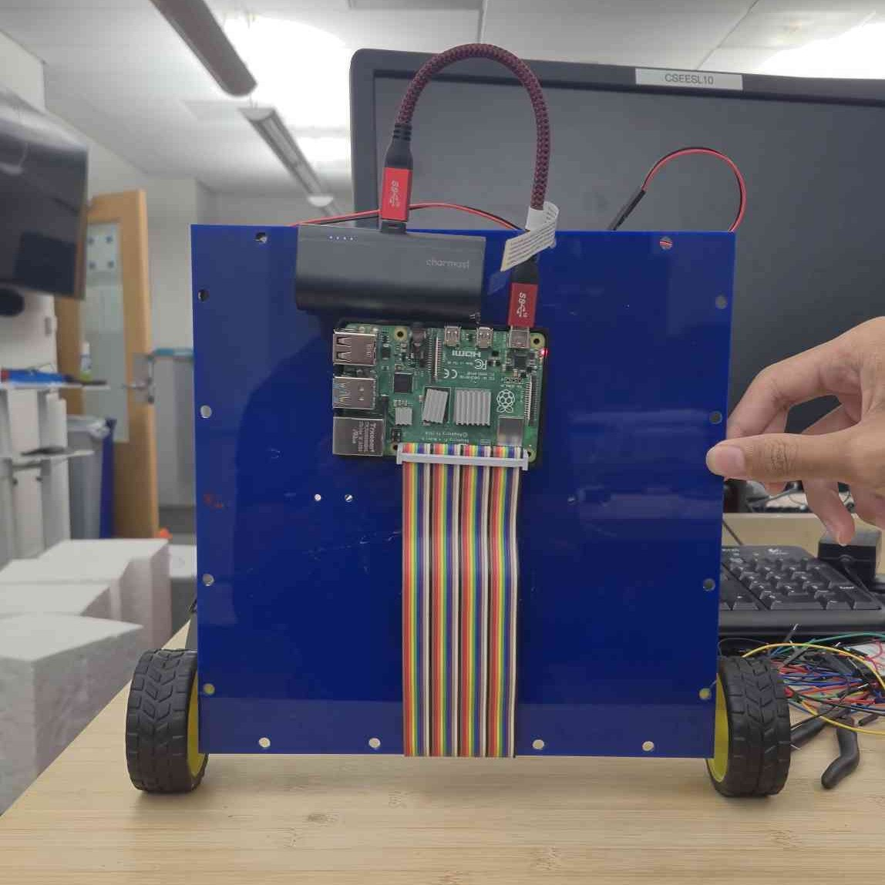
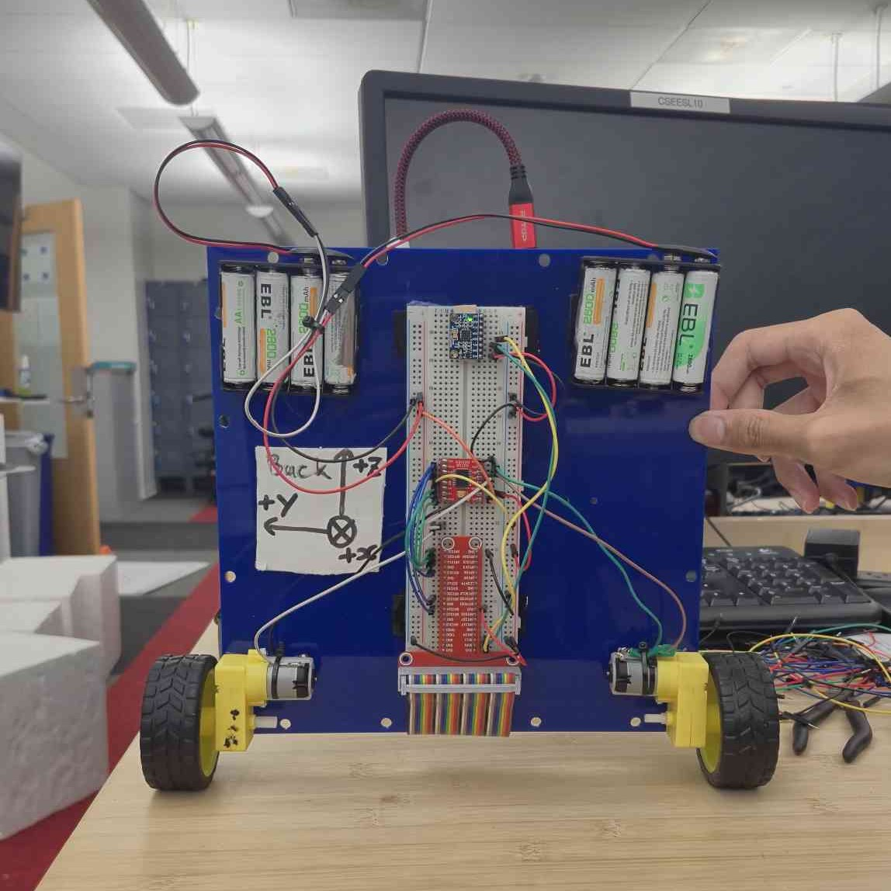
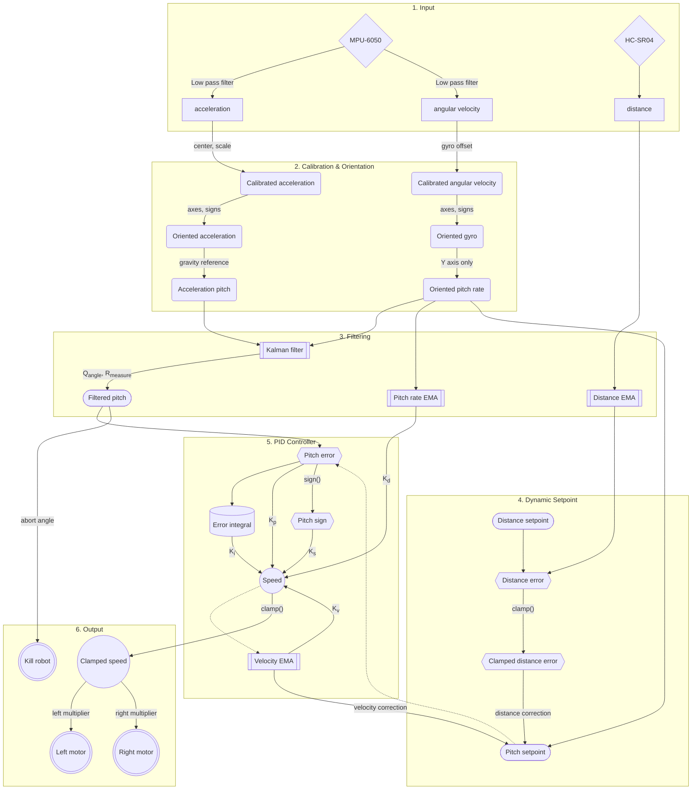

# Balance Bot

[](https://www.python.org/downloads/)
[](https://www.raspberrypi.com/)
[]()
[](LICENSE)

An autonomous two-wheeled self-balancing inverted-pendulum robot built from scratch for the UCSD SPIS 2026 Final Project.

The system executes a real-time 200 Hz PID control loop on a Raspberry Pi 4 Model B running Python 3.13. It incorporates multi-axis sensor calibration, discrete Kalman filter state estimation, non-blocking ultrasonic rangefinding, motor deadband friction compensation, and dynamic setpoint scheduling to balance indefinitely and maintain its distance from a wall without wheel encoders.

---

## Table of Contents

- [Project Demo](#project-demo)
- [System Overview](#system-overview)
- [Hardware Architecture & Pinout](#hardware-architecture--pinout)
- [Mathematical Foundations & Control Theory](#mathematical-foundations--control-theory)
  - [Coordinate Frame & Conventions](#coordinate-frame--conventions)
  - [Sensor Calibration Methodology](#sensor-calibration-methodology)
  - [Time-Independent Exponential Moving Average (EMA)](#time-independent-exponential-moving-average-ema)
  - [State Estimation: Kalman Filter vs. Complementary Filter](#state-estimation-kalman-filter-vs-complementary-filter)
  - [PID Controller with Friction Compensation](#pid-controller-with-friction-compensation)
  - [Encoder-Free Velocity Compensation & Dynamic Setpoint](#encoder-free-velocity-compensation--dynamic-setpoint)
  - [Autonomous Standoff & Position Maintenance](#autonomous-standoff--position-maintenance)
- [Full Diagram of Control Loop](#full-diagram-of-control-loop)
- [Control Loop Layer Walkthrough](#control-loop-layer-walkthrough)
- [Real-Time Software Architecture](#real-time-software-architecture)
- [Repository Structure](#repository-structure)
- [Setup & Operation Guide](#setup--operation-guide)
  - [Prerequisites](#prerequisites)
  - [Installation](#installation)
  - [Calibration Routine](#calibration-routine)
  - [Running the Robot](#running-the-robot)
- [License & Acknowledgments](#license--acknowledgments)

---

## Project Demo

<div align="center">
   &nbsp; &nbsp;
  
</div>

The two images show the sides of one of the versions of the balance bot (without the ultrasonic).

[This video](https://drive.google.com/file/d/18JYDSTSzwClRAvSJqxGlaYQZfH-39KAy/preview) shows the demo during the SPIS final project presentations.

[This video](https://drive.google.com/file/d/1HAtJf2yUEG15098cgfTglrYO538r6821/preview) shows a trial where the bot balances for over 3 minutes until the batteries died.

## System Overview

An inverted pendulum is inherently non-linear and open-loop unstable: gravity produces a torque proportional to the sine of the tilt angle ($\tau_g = mgl \sin\theta$), causing the robot to accelerate toward the ground if tilt occurs. To stay upright, the robot must rapidly accelerate its base forward beneath its center of mass, requiring reaction times well under $50\text{ ms}$.

### Technical Challenges Solved

1. **Severe Sensor Noise & Integration Drift**: Low-cost accelerometers suffer heavy vibration pollution from DC motor gearboxes, while gyroscopes suffer from zero-rate integration drift. Solved via multi-axis calibration and a discrete 2-state Kalman filter.
2. **Jitter Filtering & Tick Rate Variation**: Traditional digital filters vary their effective cutoff frequency when the loop tick rate is changed. Solved by deriving continuous-time independent exponential moving averages parameterized by physical time constants ($\tau$) instead of raw coefficients.
3. **Motor Deadband & Static Friction Gain**: DC motors with gearboxes do not turn at very low PWM duties. Solved by integrating a sign-dependent static friction feedforward gain ($K_s$) into the PID output.
4. **Velocity Runaway Without Wheel Encoders**: It is harder for the wheels to accelerate in one direction at high horizontal velocity, causing velocity to drift and eventually saturating the motors. Solved by using the EMA-filtered motor throttle as a proxy for the velocity to dynamically tilt the setpoint into the motion, decelerating. This makes the entire system stable since the low acceleration at high velocity naturally makes the speed tend towards 0.
5. **Drift in Free Space**: Without global localization, balancing robots wander across the room. Solved by integrating an asyncrhonous ultrasonic rangefinder that also adjusts the PID setpoint to make the robot maintain a fixed distance obstacles.
6. **Moment of Inertia vs. Motor Power**: If the motors are too weak and the moment of inertia is too small, the robot cannot accelerate fast enough to correct itself. A higher moment of inertia makes balancing easier. So, the heavy battery packs and microcontroller are placed at the top of the robot, and instead of using just one battery pack, two battery packs were wired in series to double the voltage.
7. **I2C Bus Noise Errors**: At any point in the program where MPU readings were taken, an infrequent but inevitable `OSError` (I/O error) often crashed the entire program. It may have been caused by long, unshielded SDA and SCL lines. The reliable fix was to protect all MPU raw readings with a `try`-`except` block to suppress the sporadic `OSError` with minimal consequences.

---

## Hardware Architecture & Pinout

```
+---------------------------------------------------------------------------------+
|                                 Raspberry Pi 4B                                 |
|                                                                                 |
|  [I2C: SDA / SCL]  <=========>  MPU-6050 6-DOF IMU (Accelerometer + Gyroscope)  |
|                                                                                 |
|  [GPIO 6 (Trig)]   ---------->  HC-SR04 Ultrasonic Distance Sensor              |
|  [GPIO 5 (Echo)]   <----------  (Interrupt capture via pulseio)                 |
|                                                                                 |
|  [GPIO 13, 19, 26] ---------->  TB6612FNG Motor Driver A (Right DC Motor)       |
|  [GPIO 21, 20, 16] ---------->  TB6612FNG Motor Driver B (Left DC Motor)        |
+---------------------------------------+-----------------------------------------+
                                        | Motor Power: 12V (2x in-series 4x AA Battery Pack)
                                        v
                          [Dual 12V DC Gearmotors]
```

### Table of Materials

| Component | Role | Interface / Specs |
|---|---|---|
| **Raspberry Pi 4 Model B** | Primary Controller | Linux / Python 3.13 |
| **MPU-6050** | 6-DOF IMU (Accel + Gyro) | I2C (`0x68`) |
| **HC-SR04** | Ultrasonic Distance Sensor | GPIO Trigger / Echo, 2 cm – 400 cm range |
| **TB6612FNG** | Dual H-Bridge Driver | High-efficiency MOSFET driver, 1.2A continuous / 3.2A peak |
| **Dual DC Gearmotors** | Output & Balancing | Powered at 12V with independent PWM control |
| **2x Battery Pack** | Power Supply | In-series 4x AA battery packs ($12\text{V}$ nominal) |

### GPIO Pin Mapping

| Raspberry Pi Pin (BCM) | Device Pin | Subsystem | Description |
|---|---|---|---|
| **GPIO 2 (SDA)** | `SDA` | MPU-6050 | I2C Data Line |
| **GPIO 3 (SCL)** | `SCL` | MPU-6050 | I2C Clock Line |
| **GPIO 6** | `TRIG` | HC-SR04 | Ultrasonic 10 µs Trigger Output |
| **GPIO 5** | `ECHO` | HC-SR04 | Hardware Pulse Capture Input (`pulseio.PulseIn`) |
| **GPIO 13** | `IN1` | Right Motor (A) | Direction Logic Input 1 |
| **GPIO 19** | `IN2` | Right Motor (A) | Direction Logic Input 2 |
| **GPIO 26** | `PWM` | Right Motor (A) | Speed Control PWM ($1\text{ kHz}$) |
| **GPIO 21** | `IN1` | Left Motor (B) | Direction Logic Input 1 |
| **GPIO 20** | `IN2` | Left Motor (B) | Direction Logic Input 2 |
| **GPIO 16** | `PWM` | Left Motor (B) | Speed Control PWM ($1\text{ kHz}$) |

---

## Mathematical Foundations & Control Theory

### Coordinate Frame & Conventions

The balance bot operates in a right-handed body reference frame attached to the robot chassis:
* **$+X$ axis**: Perpendicular to the front of the robot (forward).
* **$+Y$ axis**: Points directly to the left side of the robot.
* **$+Z$ axis**: Points upward toward the top of the robot.
* **Pitch ($\theta$)**: Rotation about the body $Y$-axis. Tilting forward corresponds to positive pitch, and an upright robot corresponds to $\theta = 0.0^\circ$.
* **Motor Output**: Throttle values range from $[-1.0, 1.0]$, where positive throttle commands forward acceleration.

Because the physical MPU-6050 chip is mounted according to hardware space constraints, the raw sensor coordinate system is mapped to the robot body frame using axis permutation and sign inversion:
```python
mpu_axes = (2, 0, 1)  # Maps raw (Z, X, Y) -> robot body frame
mpu_signs = (-1, 1, -1)  # Directional sign alignment
```

(Note that a rotation matrix could also be used but this would be overkill as the MPU is always mounted with axes aligned.)

---

### Sensor Calibration Methodology

Raw IMU data exhibits zero-rate offset bias and sensitivity scale inaccuracies due to manufacturing variations. Therefore, calibration is needed prior to deployment.

#### 1. Gyroscope Zero-Rate Bias Calibration ([`calibrate_gyro.py`](calibrate_gyro.py))
When stationary, an ideal gyroscope measures $0\text{ rad/s}$. The calibration routine records $N = 1000$ samples over $10\text{ seconds}$ at rest and computes the bias vector:

$`\mathbf{b}_{\text{gyro}} = \frac{1}{N} \sum_{k=1}^{N} \boldsymbol{\omega}_k`$

In the control loop, calibrated angular velocity is obtained via zero-offset subtraction:

$`\boldsymbol{\omega}_{\text{cal}} = \boldsymbol{\omega}_{\text{raw}} - \mathbf{b}_{\text{gyro}}`$

#### 2. Accelerometer 6-Orientation Multi-Pose Calibration ([`calibrate_acceleration.py`](calibrate_acceleration.py))
To calibrate both sensitivity scaling and zero-offsets across all 3 axes, an interactive 6-pose routine positions each axis parallel and antiparallel to Earth's gravity vector ($\pm 1g$):

1. **Span Midpoint**: Computes center point from extreme peak measurements: \
   $`\text{center}_{\text{span}} = \frac{v_{\max} + v_{\min}}{2}`$
2. **Orthogonal Zero Averaging**: Computes the mean of the 4 independent perpendicular poses where gravity along that axis should be zero: \
   $`\text{center}_{\text{ortho}} = \frac{1}{4} \sum_{j=1}^{4} v_{\text{zero}, j}`$
3. **Refined Bias & Scale Factor**: Combines both metrics to isolate cross-axis coupling: \
   $`\text{center} = 0.5 \cdot \text{center}_{\text{span}} + 0.5 \cdot \text{center}_{\text{ortho}}`$ \
   $`\text{scale} = \frac{2g}{v_{\max} - v_{\min}} \quad \text{where } g = 9.80665\text{ m/s}^2`$

(Note that the weighted average for the center can be changed if one measure is deemed more accurate. In the actual configuration, only the ortho center measure was used.)

During runtime, raw acceleration readings are calibrated via:

$`\mathbf{a}_{\text{cal}} = (\mathbf{a}_{\text{raw}} - \text{center}) \odot \text{scale}`$

---

### Time-Independent Exponential Moving Average (EMA)

Standard discrete low-pass filters take the form $y_k = (1 - \alpha) y_{k-1} + \alpha x_k$, where $\alpha$ is a constant. However, if the loop step $\Delta t$ varies due to processing jitter or if the tick rate (e.g. $200 \text{ Hz}$) is changed, the effective cutoff frequency drifts.

To decouple filter responsiveness from loop frequency, the [`IndependentEMA`](independent_ema.py) module parameterizes smoothing using a continuous physical time constant $\tau$ (the duration required to reach $\approx 63.2\%$ of a step input):

$`\alpha(\Delta t) = 1 - e^{-\frac{\Delta t}{\tau}}`$

$`y_k = y_{k-1} + \alpha(\Delta t) \cdot (x_k - y_{k-1})`$

This formulation ensures identical temporal response regardless of whether loop iterations take $5.0\text{ ms}$ or $25.0\text{ ms}$.

---

### State Estimation: Kalman Filter vs. Complementary Filter

Pitch can be measured through two independent sensor sources:
1. **Accelerometer Pitch**: Provides an absolute gravity reference by measuring the gravitational projection: \
   $`\theta_{\text{acc}} = \text{atan2}\left(-a_x, \sqrt{a_y^2 + a_z^2}\right)`$
   - *Strengths*: Absolute reference with zero long-term drift.
   - *Limitations*: Susceptible to mechanical motor vibration and linear chassis acceleration.
2. **Gyroscope Pitch Rate**: Measures angular rate $\omega_y$: \
   $`\theta_{\text{gyro}}(t) = \int_0^t \omega_y(\tau) \, d\tau`$
   - *Strengths*: High-bandwidth response, completely immune to linear acceleration shocks.
   - *Limitations*: Numerical integration accumulates bias over time, resulting in unbounded angular drift.

#### Complementary Filter Baseline ([`complementary_filter.py`](complementary_filter.py))
Combines high-pass filtered gyro integration with low-pass filtered accelerometer pitch:

$`\theta_k = \gamma \left(\theta_{k-1} + \omega_y \Delta t\right) + (1 - \gamma) \theta_{\text{acc}}`$

While effective with $\gamma \approx 0.98$, it lacks a dynamic model of uncertainty and fails to reject non-gravitational linear accelerations during aggressive motor reversals.

The complementary filter was dropped during development in favor of a Kalman filter.

#### 2-State Discrete Kalman Filter ([`kalman_filter.py`](kalman_filter.py))
The project deploys a continuous-discrete linear Kalman filter estimating both the tilt angle $\theta$ and the uncalibrated gyro bias $b$:

$`\mathbf{x} = \begin{bmatrix} \theta \\ b \end{bmatrix}, \quad \dot{\theta} = \omega - b`$

##### 1. State & Covariance Prediction
$`\hat{\theta}_{k|k-1} = \hat{\theta}_{k-1|k-1} + \Delta t (\omega_k - \hat{b}_{k-1|k-1})`$ \
$`\hat{b}_{k|k-1} = \hat{b}_{k-1|k-1}`$

The error covariance $\mathbf{P}$ is propagated using process noise variances $Q_{\text{angle}}$ and $Q_{\text{bias}}$: \
$`\mathbf{P}_{k|k-1} = \mathbf{F} \mathbf{P}_{k-1|k-1} \mathbf{F}^T + \mathbf{Q} \Delta t`$

##### 2. Innovation & Kalman Gain
With observation matrix $`\mathbf{H} = \begin{bmatrix} 1 & 0 \end{bmatrix}`$ and measurement covariance $`R_{\text{measure}}`$: \
$`S = P_{00} + R_{\text{measure}}`$ \
$`\mathbf{K} = \begin{bmatrix} P_{00} / S \\ P_{10} / S \end{bmatrix}`$

##### 3. Measurement Update
$`y_k = \theta_{\text{acc}} - \hat{\theta}_{k|k-1}`$ \
$`\hat{\mathbf{x}}_{k|k} = \hat{\mathbf{x}}_{k|k-1} + \mathbf{K} y_k`$ \
$`\mathbf{P}_{k|k} = (\mathbf{I} - \mathbf{K}\mathbf{H}) \mathbf{P}_{k|k-1}`$

**Tuned Parameters** ([`constants.py`](constants.py)):
* $Q_{\text{angle}} = 0.0001$ (accelerometer process noise variance)
* $Q_{\text{bias}} = 0.003$ (gyro drift process noise variance)
* $R_{\text{measure}} = 5.0$ (measurement noise covariance)

This model heavily filters high-frequency chassis vibrations while tracking fast dynamic pitch maneuvers without lag.

The primary factor is the ratio between $Q_{\text{angle}}$ and $R_{\text{measure}}$. A higher ratio trusts the acceleromter more, decreasing latency but increasing noise.

---

### PID Controller with Friction Compensation

The feedback controller ([`pid_controller.py`](pid_controller.py)) computes the motor speed demand based on error $e = \theta_{\text{setpoint}} - \theta_{\text{filtered}}$:

$`\text{Speed} = -\left( K_p e + K_i \int e \, dt - K_d \frac{d\theta}{dt} + K_s \cdot \text{sgn}(e) - K_v v \right)`$

```
                                  +-------------------+
                   +------------> |  Kp * error       | ---+
                   |              +-------------------+    |
                   |              +-------------------+    |
                   +------------> |  Ks * sgn(error)  | ---+
                   |              +-------------------+    |
  Error            |              +-------------------+    |
(Setpoint - Pitch) +------------> |  Ki * Integral    | ---+---> Sum ---> Clamped Throttle
                   |              +-------------------+    |
                   |              +-------------------+    |
Pitch Rate (Gyro)  +------------> | -Kd * Pitch Rate  | ---+
                                  +-------------------+    |
                                  +-------------------+    |
Velocity (EMA)     +------------> |  Kv * Velocity    | ---+
                                  +-------------------+
```

1. **Proportional Term ($K_p = 0.50$)**: Acts as a restoring spring proportional to tilt displacement.
2. **Derivative Term ($K_d = 0.006$)**: Dampens system oscillation. Crucially, the derivative is computed directly on the gyroscope pitch rate ($\omega_y$) rather than $\frac{de}{dt}$, reducing noise and eliminating *derivative kick* when the setpoint changes dynamically.
3. **Integral Term ($K_i = 0.00$)**: Kept at zero to prevent integrator windup and phase lag in an inherently unstable second-order system. Instead, the throttle-proxy is used to prevent drifting.
4. **Static Friction Feedforward ($K_s = 0.10$)**: DC motor gearboxes exhibit static stiction. When error is non-zero, adding $K_s \cdot \text{sgn}(e)$ immediately injects sufficient voltage to overcome motor deadband, eliminating low-amplitude hunting cycles.

---

### Encoder-Free Velocity Compensation & Dynamic Setpoint

A classic problem with two-wheeled robots lacking optical wheel encoders is **velocity runaway**. If the robot leans forward slightly to counteract a disturbance, it must travel forward. As forward linear velocity increases, back-EMF reduces available motor acceleration torque until the motors saturate, causing the robot to fall.

To solve this without encoders:
1. **Throttle as Velocity Observer**: Over short durations, motor command represents chassis acceleration; over longer windows, average motor throttle serves as a reliable proxy for linear velocity: \
   $`v_k = \text{EMA}_{\tau=0.5\text{s}}(\text{clamped\_speed})`$
2. **Velocity Damping ($K_v = 0.8$)**: Directly subtracts a velocity term from the motor output to apply active braking.
3. **Dynamic Setpoint Scheduling**: When the velocity observer detects steady forward motion ($v > 0$), the controller actively leans the robot *backward* by tilting the setpoint in the opposing direction: \
   $`\Delta \theta_{\text{vel}} = \arctan(C_v \cdot v)`$ \
   $`\theta_{\text{setpoint}} = \theta_{\text{base}} - \text{degrees}\left(\arctan\left(C_v \cdot v - C_d \cdot e_{\text{dist}}\right)\right)`$ \
   Where $C_v = 0.10\text{ s/m}$. Leaning back against the direction of travel naturally decelerates the robot to a standstill.
   Applying $\arctan$ ensures that the dynamic setpoint always makes sense (in interval $(-90^\circ, 90^\circ)$).

---

### Autonomous Standoff & Position Maintenance

To prevent free-space drift and enable autonomous wall-tracking, the robot mounts an HC-SR04 ultrasonic rangefinder on its rear chassis:

* **Non-Blocking Measurement**: Standard Adafruit/Python ultrasonic drivers block the CPU for up to $30\text{ ms}$ while waiting for the echo pulse, which would destroy a $200\text{ Hz}$ control loop. The [`NonblockingHCSR04`](hcsr04.py) driver fires a $10\text{ µs}$ pulse non-blockingly and uses hardware pulse timing via CircuitPython's `pulseio.PulseIn` interrupt buffer.
* **Cascaded Distance Loop**: \
  $`e_{\text{dist}} = \text{clamp}\left(d_{\text{target}} - d_{\text{filtered}}, -e_{\max}, e_{\max}\right)`$ \
  Where $d_{\text{target}} = 40.0\text{ cm}$, $e_{\max} = 20.0\text{ cm}$, and $C_d = 0.003\text{ rad/cm}$.

When an obstacle approaches closer than $40\text{ cm}$, $e_{\text{dist}}$ turns negative, pitching the setpoint forward so the robot drives away until distance equilibrium is restored. The $\text{clamp}$ is needed to prevent massive overcorrection for erroneous or maximum range distances.

---

## Full Diagram of Control Loop


```mermaid
flowchart TD
    subgraph Layer1 [1. Input]
        MPU{MPU-6050}
        HCSR04{HC-SR04}
        ACCEL[acceleration]
        GYRO[angular velocity]
        DISTANCE[distance]
    end

    subgraph Layer2 [2. Calibration & Orientation]
        CAL_ACCEL(Calibrated acceleration)
        CAL_GYRO(Calibrated angular velocity)
        ORI_ACCEL(Oriented acceleration)
        ORI_GYRO(Oriented gyro)
        ACCEL_PITCH(Acceleration pitch)
        ORI_PITCH_RATE(Oriented pitch rate)
    end

    subgraph Layer3 [3. Filtering]
        KALMAN[[Kalman filter]]
        FIL_PITCH([Filtered pitch])
        DISTANCE_EMA[[Distance EMA]]
        PITCH_RATE_EMA[[Pitch rate EMA]]
    end

    subgraph Layer4 [4. Dynamic Setpoint]
        SETPOINT([Pitch setpoint])
        DISTANCE_ERROR{{Distance error}}
        DISTANCE_SETPOINT([Distance setpoint])
        CLAMPED_DISTANCE_ERROR{{Clamped distance error}}
    end

    subgraph Layer5 [5. PID Controller]
        PITCH_ERROR{{Pitch error}}
        ERROR_INTEGRAL[(Error integral)]
        PITCH_SIGN{{Pitch sign}}
        VELOCITY_EMA[[Velocity EMA]]
        SPEED((Speed))
    end

    subgraph Layer6 [6. Output]
        CLAMPED_SPEED((Clamped speed))
        LEFT_MOTOR(((Left motor)))
        RIGHT_MOTOR(((Right motor)))
        KILL(((Kill robot)))
    end

    %% Force strictly vertical subgraph ordering
    Layer1 ~~~ Layer2
    Layer2 ~~~ Layer3
    Layer3 ~~~ Layer4
    Layer4 ~~~ Layer5
    Layer5 ~~~ Layer6
    
    %% Layer 1
    MPU -->|Low pass filter| ACCEL
    MPU -->|Low pass filter| GYRO
    HCSR04 --> DISTANCE

    %% Layer 2
    ACCEL -->|center, scale| CAL_ACCEL
    GYRO -->|gyro offset| CAL_GYRO
    CAL_ACCEL -->|axes, signs| ORI_ACCEL
    CAL_GYRO -->|axes, signs| ORI_GYRO
    ORI_ACCEL -->|gravity reference| ACCEL_PITCH
    ORI_GYRO -->|Y axis only| ORI_PITCH_RATE

    %% Layer 3
    ACCEL_PITCH --> KALMAN
    ORI_PITCH_RATE --> KALMAN
    KALMAN -->|"Q<sub>angle</sub>, R<sub>measure</sub>"| FIL_PITCH
    DISTANCE --> DISTANCE_EMA
    ORI_PITCH_RATE --> PITCH_RATE_EMA

    %% Layer 4
    ORI_PITCH_RATE --> SETPOINT
    VELOCITY_EMA -->|velocity correction| SETPOINT
    DISTANCE_EMA --> DISTANCE_ERROR
    DISTANCE_SETPOINT --> DISTANCE_ERROR
    DISTANCE_ERROR -->|"clamp()"| CLAMPED_DISTANCE_ERROR
    CLAMPED_DISTANCE_ERROR -->|distance correction| SETPOINT

    %% Layer 5
    SETPOINT -.-> PITCH_ERROR
    FIL_PITCH --> PITCH_ERROR
    PITCH_ERROR --> ERROR_INTEGRAL
    PITCH_ERROR -->|"K<sub>p"| SPEED
    PITCH_ERROR -->|"sign()"| PITCH_SIGN
    PITCH_SIGN -->|"K<sub>s"| SPEED
    ERROR_INTEGRAL -->|"K<sub>i"| SPEED
    PITCH_RATE_EMA -->|"K<sub>d"| SPEED
    VELOCITY_EMA -->|"K<sub>v"| SPEED
    SPEED -.-> VELOCITY_EMA

    %% Layer 6
    SPEED -->|"clamp()"| CLAMPED_SPEED
    CLAMPED_SPEED -->|left multiplier| LEFT_MOTOR
    CLAMPED_SPEED -->|right multiplier| RIGHT_MOTOR
    FIL_PITCH -->|abort angle| KILL
```

---

## Control Loop Layer Walkthrough

1. **Layer 1 (Input)**: Ingests raw data via I2C from the MPU-6050 with hardware low-pass filtering at $21\text{ Hz}$. Fires ultrasonic trigger pulses at $16.7\text{ Hz}$ ($60\text{ ms}$ interval).
2. **Layer 2 (Calibration & Orientation)**: Applies center-offset subtraction and scale factors to raw acceleration and angular rates. Re-indexes and inverts axes to match the physical chassis coordinate frame.
3. **Layer 3 (Filtering)**: Feeds acceleration-derived pitch and gyroscope angular rate into the Kalman filter to compute a noise-free, zero-lag pitch angle $\theta$. Applies time-independent EMAs to distance and pitch rate.
4. **Layer 4 (Dynamic Setpoint)**: Calculates distance error against the $40\text{ cm}$ setpoint and velocity error from the throttle proxy. Calculates an $\arctan$ correction angle to bias the nominal pitch setpoint.
5. **Layer 5 (PID Controller)**: Evaluates proportional error, friction sign feedforward ($K_s$), gyro angular rate damping ($K_d$), and velocity compensation ($K_v$).
6. **Layer 6 (Output)**: Clamps output throttle to $[-1.0, 1.0]$, applies asymmetric motor trim calibration (`left_multiplier = 0.89`), and drives the dual H-bridge. If $|\theta| > 45.0^\circ$, triggers the stop fail-safe, which is also a convenient physical kill switch.

---

## Real-Time Software Architecture

### Deterministic 200 Hz Execution
The main loop ([`main.py`](main.py)) executes with strict timing control:
```python
dt = current_time - last_time
if dt < 1.0 / tick_rate:
    continue  # Yield to next 5ms tick boundary
if dt > 1.5 / tick_rate:
    print(f"LAG at {get_time():.4f}s: {dt:.4f} ({dt * tick_rate - 1.0:+.0%})")
```
* **Sample Rate**: $200.0\text{ Hz}$ ($5.0\text{ ms}$ target loop time).
* **Lag Watchdog**: Detects and logs any loop cycle exceeding $7.5\text{ ms}$ ($+50\%$ lag) to monitor OS preemption.

### Safety & Fail-Safe Architecture
* **Tilt Abort Watchdog**: If pitch angle exceeds $\pm 45^\circ$, the robot detects an unrecoverable fall, halts motors and terminates execution.
* **Asymmetric Motor Trim**: Differences in gearbox resistance or motor winding between left and right motors produce yaw veer. The software balances output using a calibrated trim multiplier (`left_multiplier = 0.89`, `right_multiplier = 1.0`). This is calibrated by seeing if the robot $z-axis$ (yaw) rotation drifts over time.
* **High-Speed Telemetry Logging**: Structured runtime metrics are buffered in memory and flushed to CSV format in `.logs/` upon termination:
  * `core.txt`: Timestamp, raw pitch, filtered pitch, motor speed, dynamic setpoint.
  * `contribution.txt`: Individual contributions of $K_p$, $K_d$, $K_s$, and $K_v$.
  * `setpoint.txt`: Base setpoint, velocity correction component, distance correction component.
  * These files can be pasted into Desmos to produce a graph. Numbers are set to never use scientific notation since Desmos cannot parse it.
    * Use `scp -r ` command to copy from Raspberry Pi to computer.

---

## Repository Structure

```
balance-bot/
├── .logs/                         # Auto-generated telemetry logs (CSV format)
├── calibrate_acceleration.py      # Interactive 6-orientation accel calibration
├── calibrate_gyro.py              # Zero-rate gyro bias averaging routine
├── complementary_filter.py        # Alternative complementary filter implementation
├── constants.py                   # Centralized configuration, gains, & calibration constants
├── filtered_mpu6050.py            # High-level IMU driver with calibration & orientation logic
├── h_bridge_motor.py              # PWM and directional control for TB6612FNG H-bridge
├── hcsr04.py                      # Non-blocking HC-SR04 driver using pulseio hardware interrupts
├── independent_ema.py             # Time-independent continuous Exponential Moving Average
├── kalman_filter.py               # 2-state discrete Kalman filter (angle, gyro bias)
├── main.py                        # 200 Hz real-time control loop & telemetry collector
├── pid_controller.py              # Custom PID implementation with static friction feedforward
├── pyproject.toml                 # Project metadata, dependencies, and type-checking config
└── README.md                      # Documentation
```

---

## Setup & Operation Guide

### Prerequisites
* **Raspberry Pi 4 Model B** running Raspberry Pi OS (Debian-based).
* **Python 3.13+** installed with hardware I2C enabled via `raspi-config`.

### Installation

1. Clone repository onto the Raspberry Pi:
   ```bash
   git clone https://github.com/msqr1/balance-bot.git
   cd balance-bot
   ```

2. Install dependencies via `pip` or modern packaging tools such as `uv`:
   ```bash
   pip install .
   ```
   ```
   uv sync --all-extras
   ```

### Calibration Routine

Before initial operation or after physical mechanical changes, run the calibration utilities:

1. **Calibrate Gyroscope**:
   ```bash
   python calibrate_gyro.py
   ```
   Keep the robot completely stationary on a flat surface. Copy the calculated bias offsets into `constants.py`:
   ```python
   calibrated_gyro_offsets = (-0.050926, 0.021809, 0.007153)
   ```

2. **Calibrate Accelerometer**:
   ```bash
   python calibrate_acceleration.py
   ```
   Follow the on-screen prompts to orient the sensor across all 6 faces. Update `constants.py` with the output centers and scale factors:
   ```python
   calibrated_centers = (0.4767, -0.0322, 0.1800)
   calibrated_scales = (1.0012, 0.9939, 0.9802)
   ```

### Running the Robot

Place the robot upright on a flat floor near an obstacle or wall and launch:
```bash
python main.py
```

* To stop execution, catch the robot or tilt it past $\pm 45^\circ$ to trigger the auto-kill switch.
  * Using keyboard interrupt `Ctrl`+`C` also works but risks the robot falling over and damaging itself.
* Telemetry data is saved to `.logs/` for offline inspection and plotting.

---

## License & Acknowledgments

This project is licensed under the [MIT License](LICENSE).

Developed as the Final Project for UCSD SPIS 2026 (Summer Program for Incoming Students) at the University of California, San Diego.

Authors:
- Anthony Le (controls, electrical, tuning)
- Gia (Rylex) Phan (mechanical, electrical, testing)
